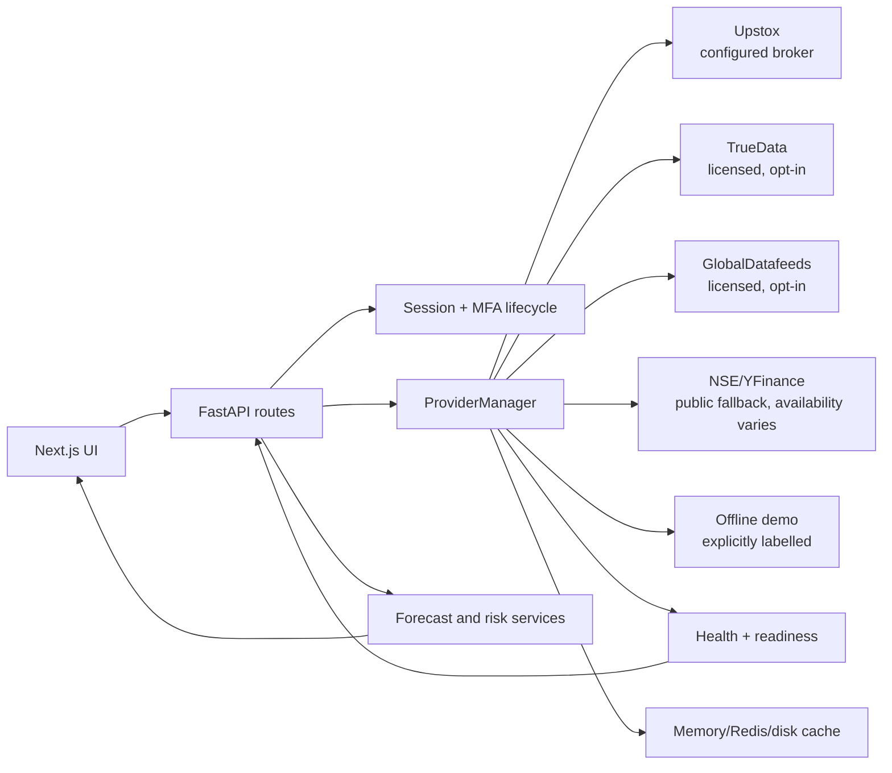

# StockPilot architecture flow

## Provider policy

TrueData and GlobalDatafeeds are implemented through the existing `MarketDataProvider`
interface and are **not** assumed available: each requires its own credentials and
licensed entitlement. `ProviderManager.health()` and `provider_readiness()` expose
`configured`, readiness, latency, and failure classification. Unconfigured or
unhealthy providers are skipped; the UI must show unavailable rather than fabricate
quotes. Offline demo data is only selected in explicit `OFFLINE_DEMO` mode.

## Quality checks

Storybook stories are intended to run with the project's Storybook a11y addon in the
consumer workspace. The dependency-free frontend tests enforce labelled controls and
the LCP/INP/CLS budgets (`frontend/lib/quality.ts`). The MFA Playwright test is
explicitly mock-only and never exercises real credentials or an authenticator.
